##### Table of Contents  
[Headers](#headers)
[Emphasis](#emphasis)  
...snip...    
<a name="headers"/>
<a name="emphasis"/>

# Introduction

# RTL to GDS flow 
At first we will have design specification, which comes from the customer end. Customer writes down the specification of the chip basically the functionality which he wants to develop in a chip. Once we have this specification we convert this into a RTL code.
## Synthesis 
This is the process where we convert RTL code into a circuit. It transforms simple RTL design into a gate-level netlist with all the constraints as specified by the designer.
## Floor Planning 
In floorplanning, e defie the size and shape of chip, place IO pins/pads, macros and blockages in the core or chip area in order to effectively find the rouing space between them. At floorplanning we reserve space for the placement of standard cells. 
## Power Planning
Power planning is stage typically part of the floorplanning stage, in which power grid network is created to distrubute the power uniformly throuhout chip
## Placement
Placement is the process of determining the locations of circuit devices on a die surface.
## Clock Tree Synthesis
Clock Tree Synthesis is a process for distributing the clock equally among all sequential part of a design so that we reduce skew and delay.
## Routing
Making physical connections using metal layers are called Routing. Routing is the stage after CTS and optimization where exact paths for the interconnection of standard cells and macros and I/O pins are determined.
## SignOff
Layout will be ready after routing stage. Some checks we have to perform soon after the completion of layout to check whether our layout works as designed. These checks are known as Signoff checks.

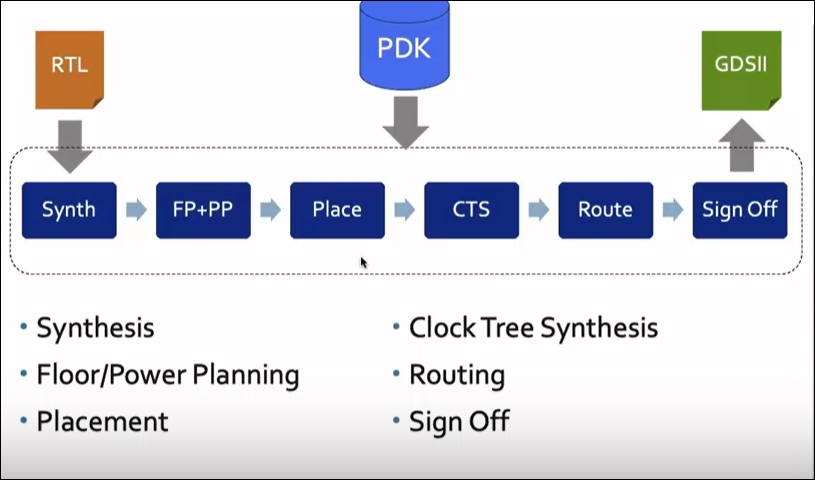

# OpenLANE
The purpose of this lab is to familiarise you with the efabless OpenLane VLSI design flow and the Skywater 130nm PDK. OpenLane is an open-source VLSI flow built around open-source tools. That is, it’s a collection of scripts that run these tools, in the right order, transforming their inputs and outputs as appropriate, and organising the results.
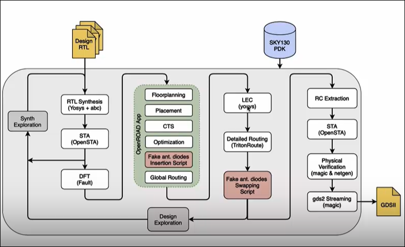

# Direcory structure
Following is the directory structure we have 
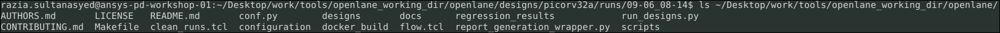
List of all the designs present
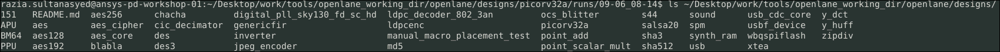
List of files present in one of the designs
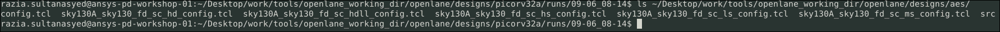
contents of config.tcl file 
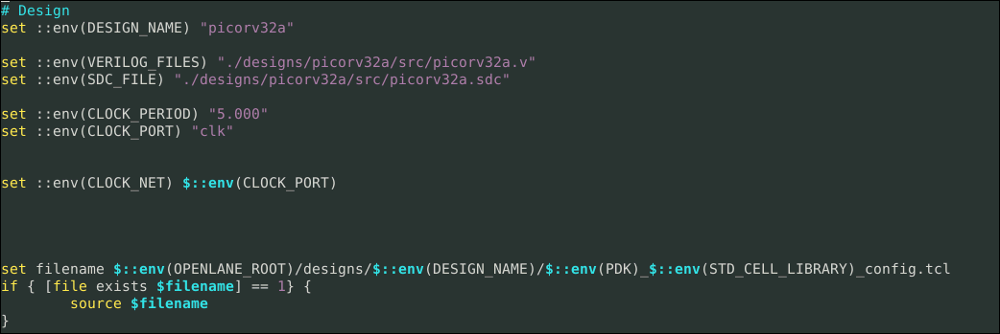

# Design preparation
 Once you are in run area run "docker" command
 source  ./flow.tcl in interactive session
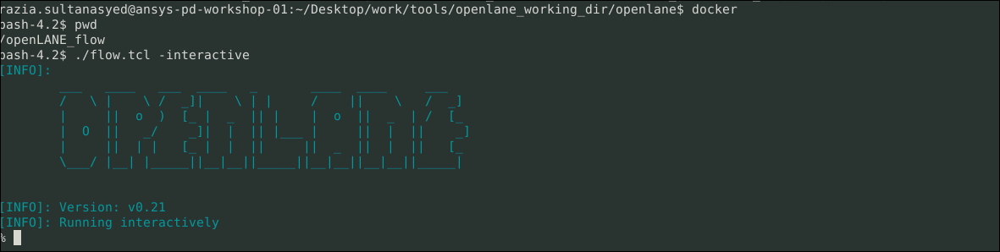

Import all the packages required for flow

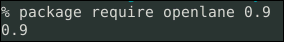

# Design setup stage
**prep design <design_name>** 
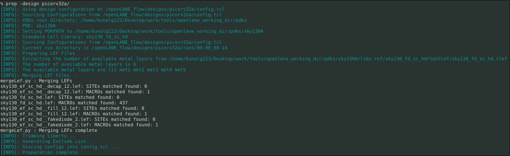

In tihs step lefs are merged and **runs** folder is created
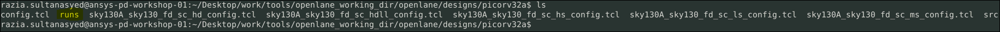
Directory structure inside **runs** 
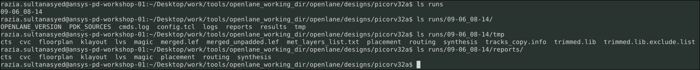
**config.tcl** file which tells us about all the environment variables settings used for this design
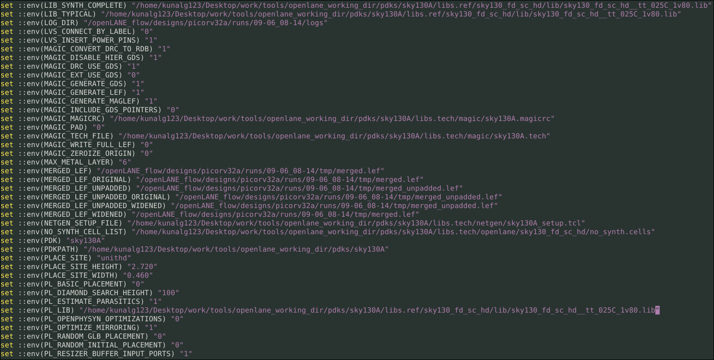

# Synthesis
**run_synthesis** in interactive session will start synthesizing the respective RTL file. Once it is completed we see message **sythesis was sucessful**. Files related to synthesis are present in **synthesis** folder in logs, reports, results directories.
We get info like chip area, numer of different cells present in design from the yosys.log file

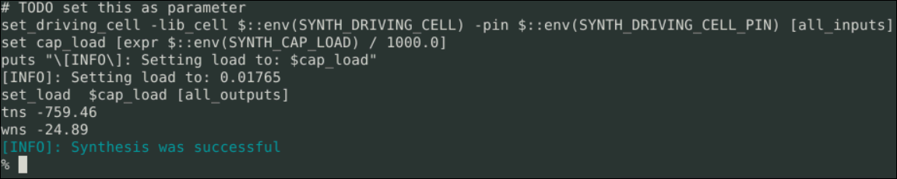
 
## Flop ratio
flop ratio is number of of dff and total number of cells in design i.e 1613/ 14876 = 10.8%

# Floor plan
Following are done in Floor plan
1. Define width and height of core and Die: 
Define the width and height of a core. 
2. Define locations of preplaced cells:
We arrange IP's in a chip at user defined locations, thus they are placed before automated placement and routing. These are called pre-placed cells
3. Placing Decoupling capacitors:
Decoupling capacitors are placed near to preplaced cells so that the POWER signal comes to these cells without any distortion
4. POWER and GROUND Routing:
Power and Ground routing is done throughout the chip inorder to provide the signal without any distortion
5. Pin Placement:
Pins are placed based on the location of cells. So that the distance between them is less. All input ports are placed on one side and output ports are placed on other side.
6. Logic cell placement blockage:
Once pin placement is done we have to make sure none of the cells are placed in this area durig automated placement. Thus we block this area.

**run_floorplan** will perform florplan. 
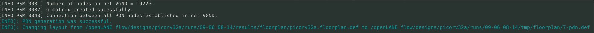

Once floorplan is completed you can see results and there wiill be a def file generated in results/floorplan folder.

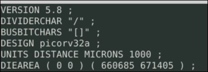

Die area is (660685/1000u)m x (671405/1000)um

We use magic tool to view floorplan layout or def file. Open magic using following command. In this command we use def file that is created after floorplan stage.
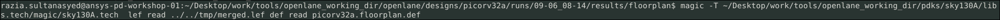

Once we run this command we see following layout
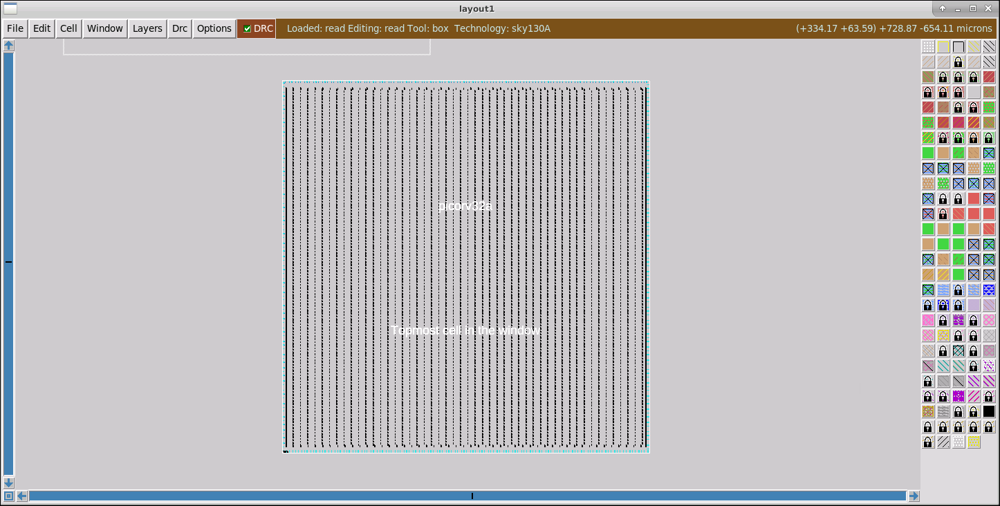

## few shortcuts for using magic tool
1. Z-for zooming in
2. ^Z-for Zooming out
3. v- for Zoom Fit
4. S- for selection
5. Once we select an item, we go to tckon window and type **what** It will show info about selected item

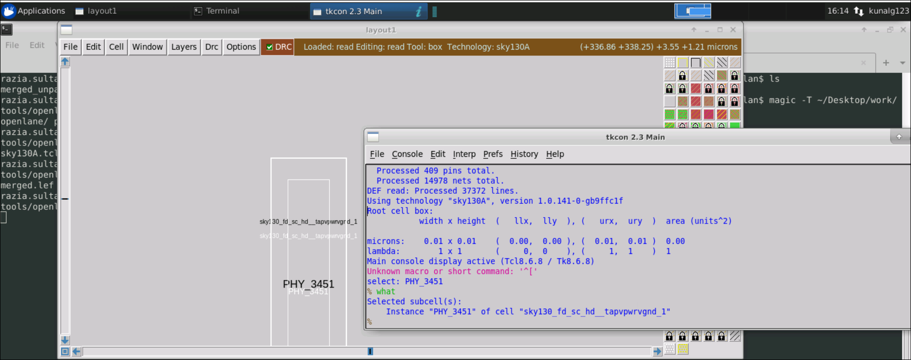

Visit http://opencircuitdesign.com/magic/index.html for more info on magic tool.

# Placement
1.	Bind Netlist with physical cells:
We Select a particular shape for a logic gate from library. 
3.	Placement:
At this stage we have preplaced cells which are placed in floorplan stage. Place the cells based on there input and output locations, based on switching of gates. 
3. Optimize placement:
In this step we decide where all we need buffers and repeaters so that signal reaches 

**run_placement** is used in interactive session to run placement. Once it is completed a new def is created in results/placement directory

using magic command to open def after placement

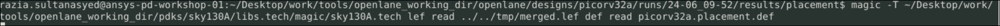

view of Layout after placement

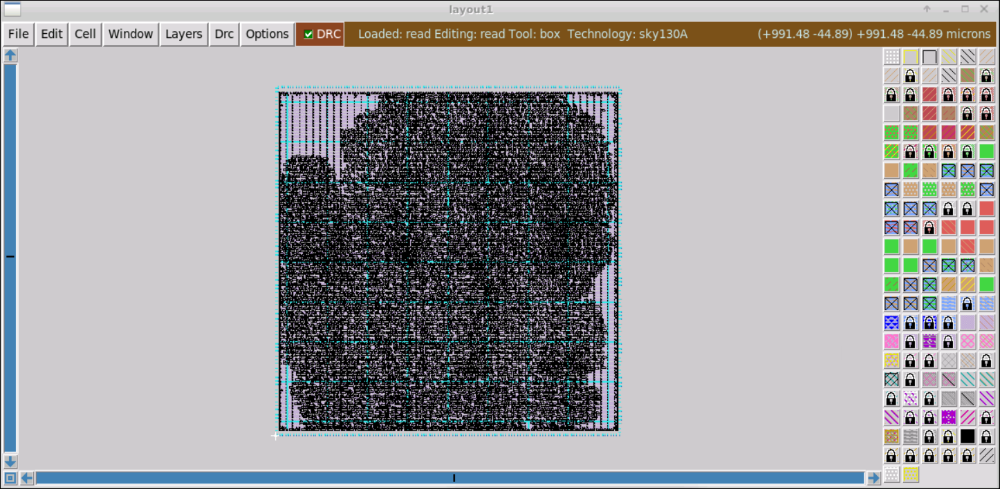

Zoom in view of layout after placement. Once placement is done we can see more standard cells, more pins compared to def file created after floorplan. Also we have power and ground nets, vias defined in this def which are not present in def created after floorplan.
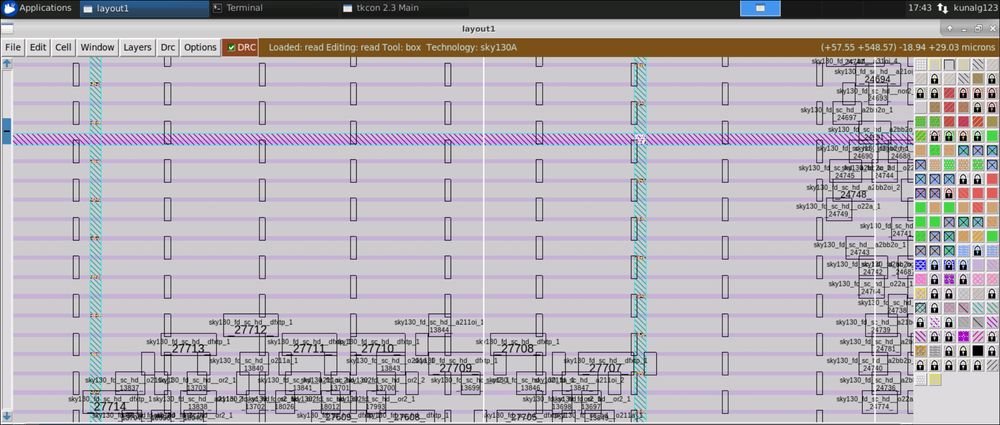

# runnning git clone 
How to build an inverter lef from scratch is described in following github page.
https://github.com/nickson-jose/vsdstdcelldesign

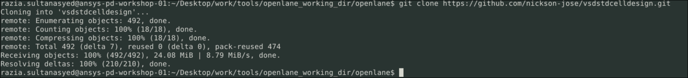

magic command for viewing inverter layout

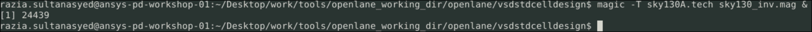

Inverter Layout viewed using magic
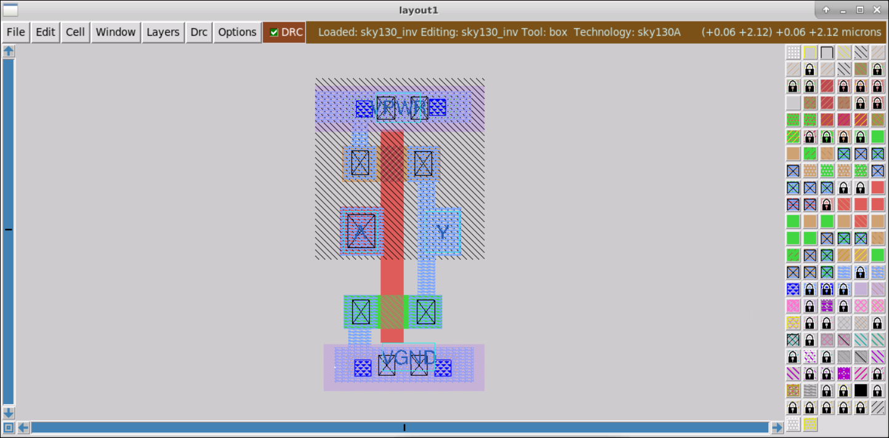

Select any item on layout and then do **what** It wil give info about item. For eg: in below snapshot we can see nwell is selected.
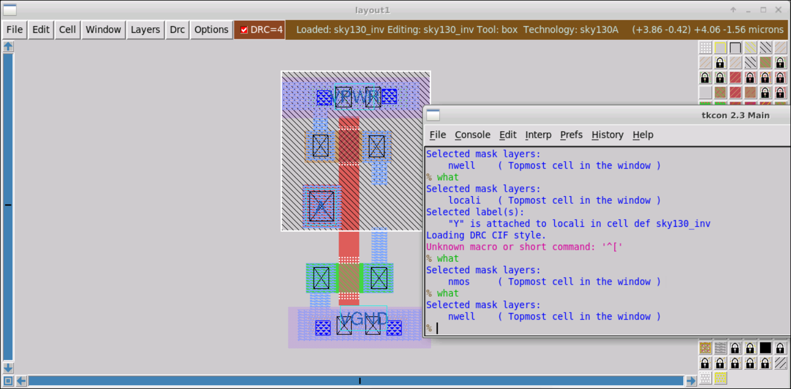

# Extracting spice netlist 

Once we have layout we can extract netlist using following commands, and then convert it to spice. 

1.extract all

extract command incrementally extracts the root cell and all its children into separate .ext files.

2. ext2spice cthresh 0 rthresh 0 

ext2spice command converts the hierarchical extracted netlist information produced by the extract command in a series of .ext files into a flattened representation in SPICE format, used for detailed analog simulation.

**rthresh [value]**
Set resistance threshold value. Lumped resistances below this value will not be written to the output. The value is in ohms, or may be the keyword infinite to prohibit writing any lumped resistances to the output.

**cthresh [value]**
Set capacitance threshold value. The value is in femtofarads, or may be the keyword infinite to prohibit writing any parasitic capacitances to the output.

3. ext2spice

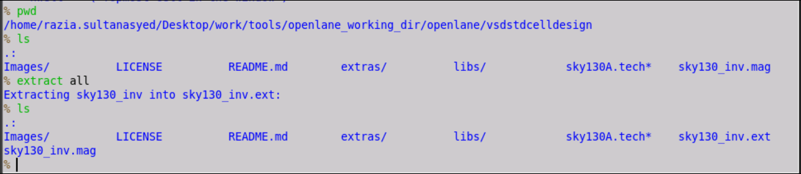

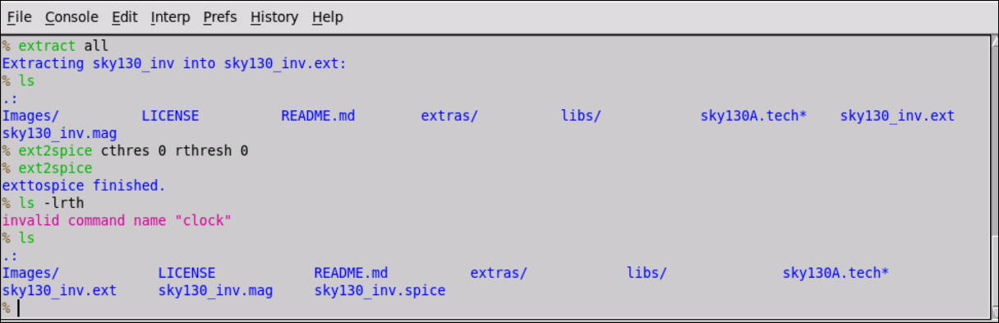

Spice file that is created. 
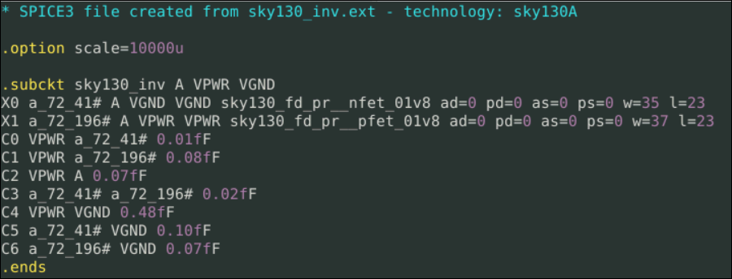

After generating spice file we include libs, voltage sources and then perform transient analysis. Following is the output of transient analysis. 
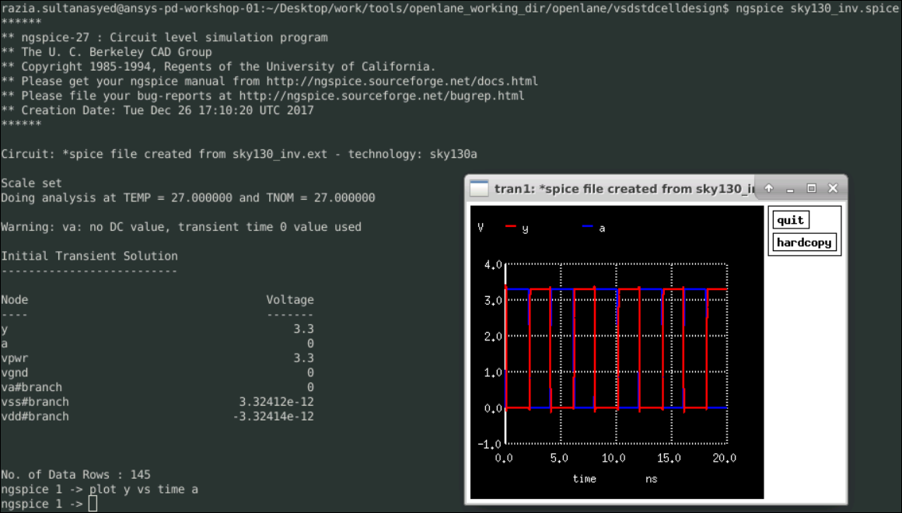

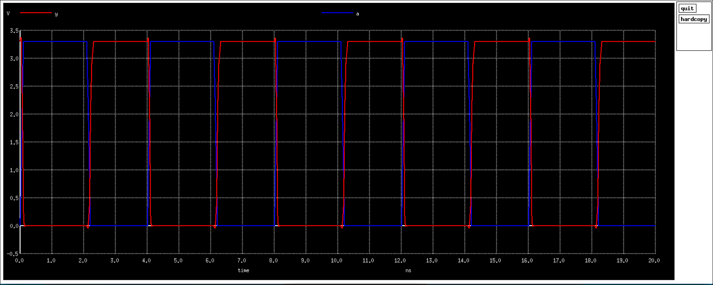

# 

